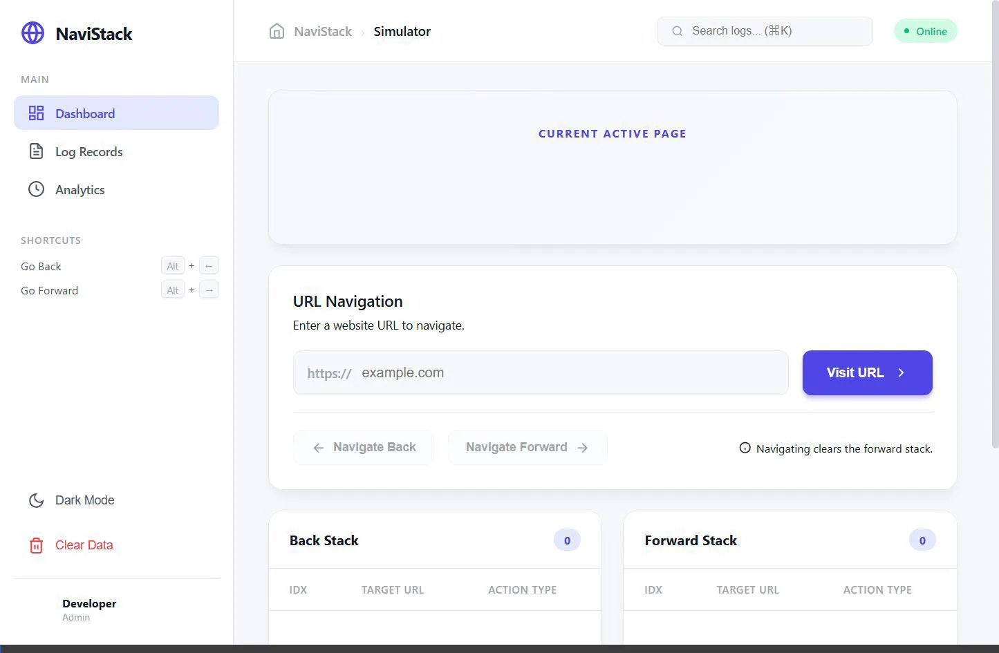

<div align="center">
  
  <h1>🚀 NaviStack</h1>
  <h3>Interactive Browser History Simulator</h3>
  <p><i>A visually stunning, interactive web application demonstrating Stack Data Structures in a real-world scenario.</i></p>

  [](https://navi-stack-interactive-browser-hist.vercel.app/)
  [](https://opensource.org/licenses/MIT)

  ---

  ## 🌐 Live Access

  To view the **NaviStack System** online:
  ### 🔗 **[Click Here for the Live Website Demonstration](https://navi-stack-interactive-browser-hist.vercel.app/)**

  ---
</div>

## 🎬 Demo



---

## 🌟 Overview

**NaviStack** is an elite-tier browser history simulator designed to provide a crystal-clear visualization of how web browsers manage navigation states using the **Stack** data structure. Built with a premium, dashboard-inspired UI, it bridges the gap between abstract computer science concepts and real-world application.

## ✨ Key Features

- **⚡ Dual-Stack Engine**: Implements the classic Back and Forward stacks for seamless navigation.
- **📊 Live Analytics**: Real-time tracking of visits and navigation actions.
- **🌓 Adaptive Theming**: Instant toggle between high-contrast Light and deep-ocean Dark modes.
- **⌨️ Power-User Shortcuts**: 
  - `Alt + Left Arrow`: Go Back
  - `Alt + Right Arrow`: Go Forward
  - `Ctrl/Cmd + K`: Quick Search
- **🔔 Interactive Toasts**: Dynamic notifications for every history event.
- **📱 Responsive Design**: Fully fluid layout that adapts to any screen size.

---

## 🧠 Data Structure: The Stack (LIFO)

At its core, NaviStack demonstrates the **Last-In, First-Out (LIFO)** principle using two primary stacks:

| Action | Back Stack | Forward Stack | Current Page |
| :--- | :--- | :--- | :--- |
| **Visit New URL** | `Push(Current)` | `Clear()` | `New URL` |
| **Go Back** | `Pop(Top)` | `Push(Current)` | `Popped URL` |
| **Go Forward** | `Push(Current)` | `Pop(Top)` | `Popped URL` |

---

## 📂 Project Structure

```text
NaviStack/
├── index.html      # Core application structure & layout
├── styles.css      # Premium design tokens & layout engine
├── script.js       # Stack logic & state management
├── README.md       # Comprehensive documentation
├── logo.png        # Custom branding asset
└── demo.webp       # Visual demonstration recording
```

---

## 🛠️ Tech Stack

- **Structure**: Semantic HTML5
- **Style**: Modern Vanilla CSS3 (Grid, Flexbox, Variables)
- **Logic**: ES6+ JavaScript (Array-based Stacks)
- **Deployment**: Vercel

---

## 🚀 Getting Started

### Local Setup
1. **Clone the repository:**
   ```bash
   git clone https://github.com/Sameerkaradbhajne/NaviStack-Interactive-Browser-History-Simulator.git
   ```
2. **Launch:** Open `index.html` in any browser or use a local server:
   ```bash
   python -m http.server 8000
   ```

---

<div align="center">
  <p>Created with passion by <b>Sameer Karadbhajne</b></p>
  <p>© 2024 NaviStack. All Rights Reserved.</p>
</div>
